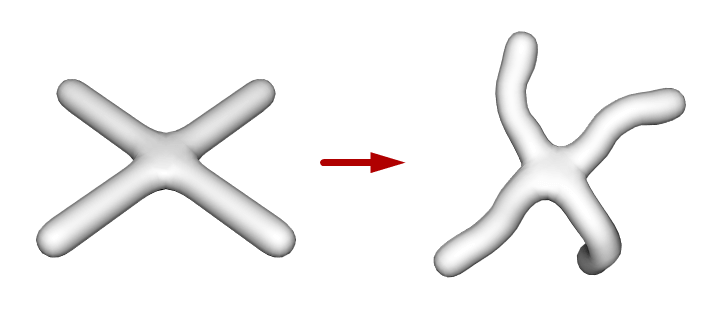

# python-rigging



## Install

This module is **not available through pip**, it was designed to be forked and extended. Simplicity is a key goal in design. This module is using [glm](https://glm.g-truc.net/) and the Python's [c-api](https://docs.python.org/3/c-api/). The implementation can be found in the [rigging.cpp](rigging.cpp).

```
git clone https://github.com/cprogrammer1994/python-rigging
cd python-rigging
python setup.py develop
```
